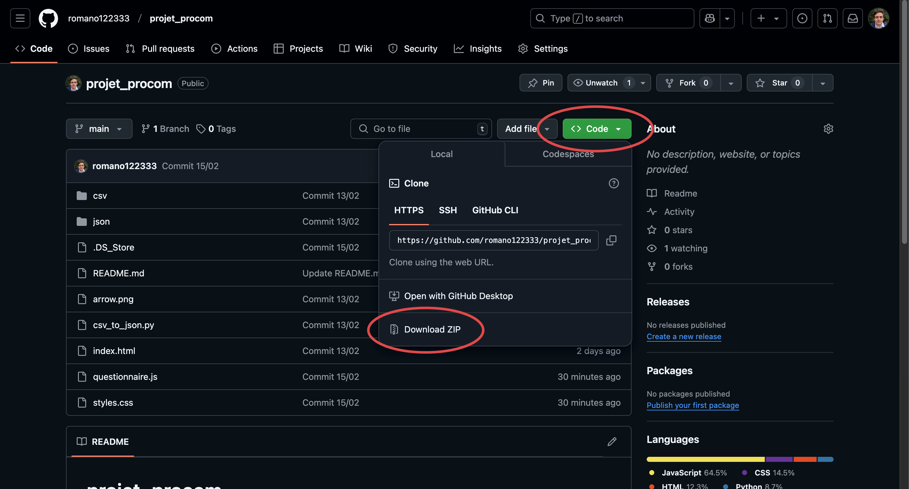
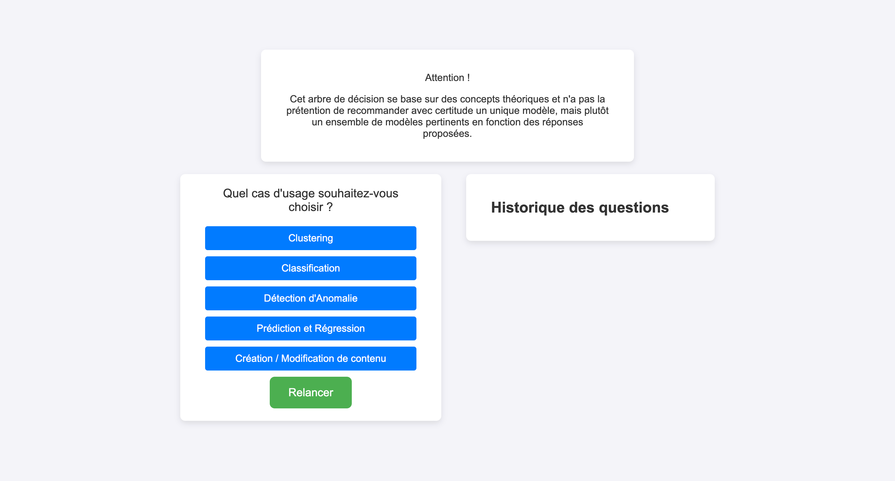

# projet_procom

## Utilisation de ce repository

### Étape 1
Téléchargez le repository sous le format zip en cliquant sur l'onglet "< > Code" puis "Download ZIP".



### Étape 2
Une fois téléchargé, dézipper le dossier. Placez-le où vouz le souhaitez.

### Étape 3
Ouvrez un Terminal, et insérez les lignes suivantes en remplaçant le chemin vers le dossier :

Mac / Linux : 

``` bash
cd chemin/prejet_procom-main
python3 -m http.server 8000
```
Windows :

```cmd
dir chemin/prejet_procom-main
python -m http.server 8000
```

Normalement, le Terminal doit retourner ceci :

Mac / Linux :
``` bash
Serving HTTP on :: port 8000 (http://[::]:8000/) ...
```

Windows :

```cmd
Serving HTTP on :: port 8000 (http://[::]:8000/) ...
```

Lorsque vous souhaitez fermer le serveur HTTP, utilisez la commande control + C.

### Étape 4

Rendez vous sur le navigateur web de votre choix, et entrez dans la barre de recherche

``` url
localhost:8000
```

Vous devriez tomber cette page :



---

## Explication des documents


### questionnaire.js

Fichier javascript qui régit le fonctionnement de l'arbre.

Précisions importantes : 
- Lorsque l'utilisateur répond "Non" à la question "Avez-vous réalisé une analyse des données ?", l'arbre s'arrête. Merci de renseigner précisément cette question dans le fichier csv source car la moindre faute de frappe va rendre cette fonctionnalité infonctionnelle.
- Les questions pour lesquelles il existe une réponse qui rend l'intégralité des modèles désuet sont passées. Ne vous étonnez donc pas qu'une certaine suite de réponse rende une question invisible dans l'arbre.

### Dossier "csv"

Lorsque vous mettez à jour le Google Sheets contenant les scores des modèles, il convient d'exporter les pages appelées "Cas_d'Usage_JSON", de les renommer :
- clustering.csv
- classification.csv
- detection_anomalies.csv
- creation_modification_contenu.csv
- prediction.csv
et des les déposer dans ce dossier.

Pour qu'ils soient convertis en fichiers .json, assurez-vous qu'il existe au moins une version de chaque cas d'usage dans le dossier csv, puis executez le script csv_to_json.py.

### Dossier "json"

Pas de modifications ne doivent être faites sur ce dossier pour une utilisation standarde de l'arbre de décision.

### Dossier "png"

Dossier qui ne sert qu'à héberger les images de ce fichier readme.md

### csv_to_json.py

Script ne servant qu'à transformer les fichiers csv en fichiers json.

### index.html + styles.css + arrow.png

Fichiers qui régissent le style graphique de la page Internet de l'arbre de décision. index.html est appelé lors de l'appel du serveur HTTP sur votre navigateur.

arrow.png correspond à la flèche qui apparaît une fois arrivé à bout de l'arbre.

---

## Ajouter un cas d'usage

Pour ajouter un cas d'usage, il faut modifier plusieurs documents pour que le workflow demeure inchangé.

### csv_to_json.py

Ajouter entre guillemets le nom du fichier csv du nouveau cas d'usage à la liste "file_names" ligne 35 : 

``` python
file_names = ["classification", "clustering", "detection_anomalies", "creation_modification_contenu", "prediction"]
```

### questionnaire.js

Dans le dictionnaire useCases de la fonction chooseUseCase(), ligne 24, ajouter un élément au dictionnaire avec en tant que clé la description du cas d'usage et en valeur associée le chemin pour accéder au fichier json du cas d'usage. N'oubliez pas la virgule après l'avant dernier élément du dictionnaire.

``` javascript
    const useCases = {
        ...
        "Création / Modification de contenu": "json/creation_modification_contenu.json",
        "Cas d'usage": "json/cas_d_usage.json"
    };
```
